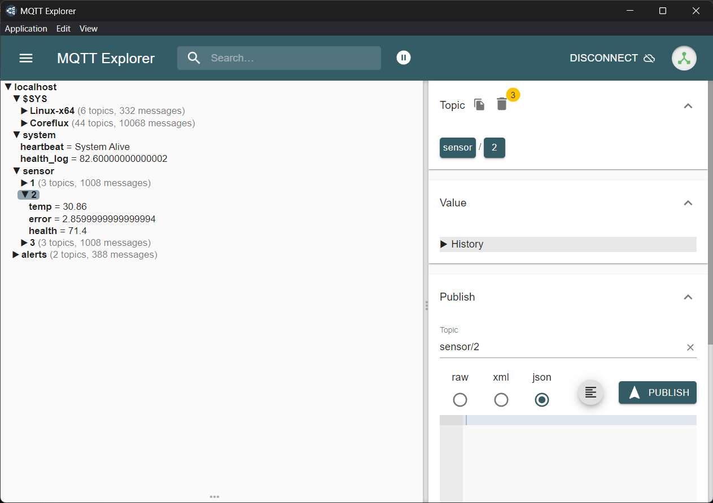
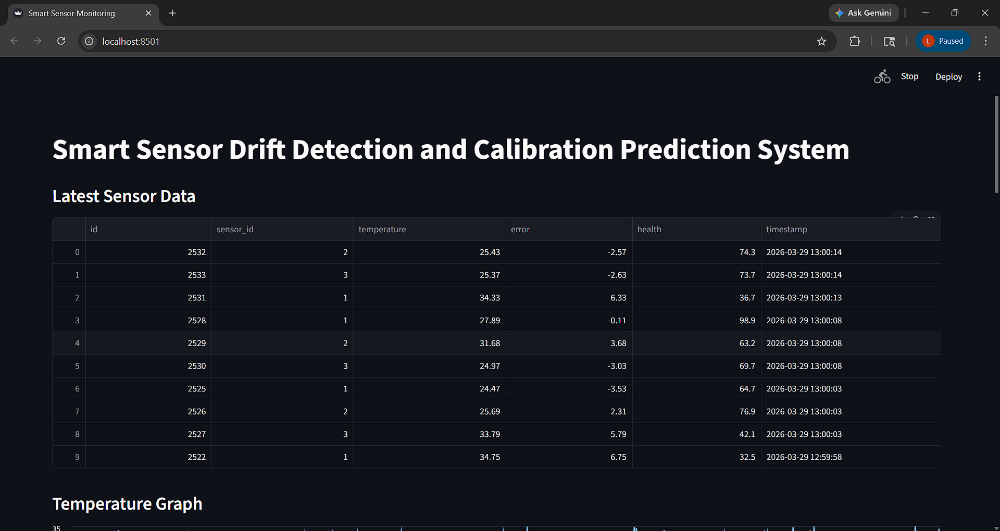
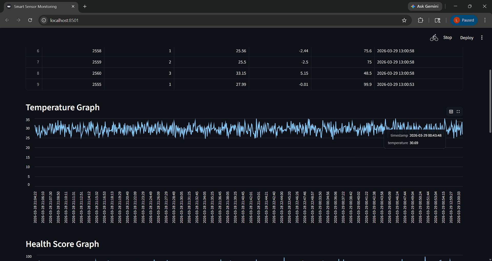
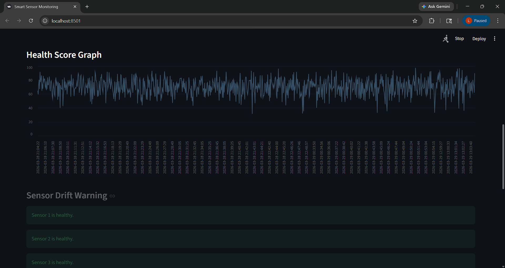
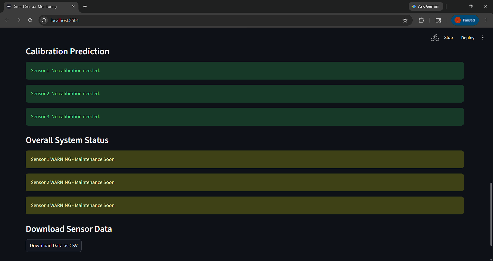
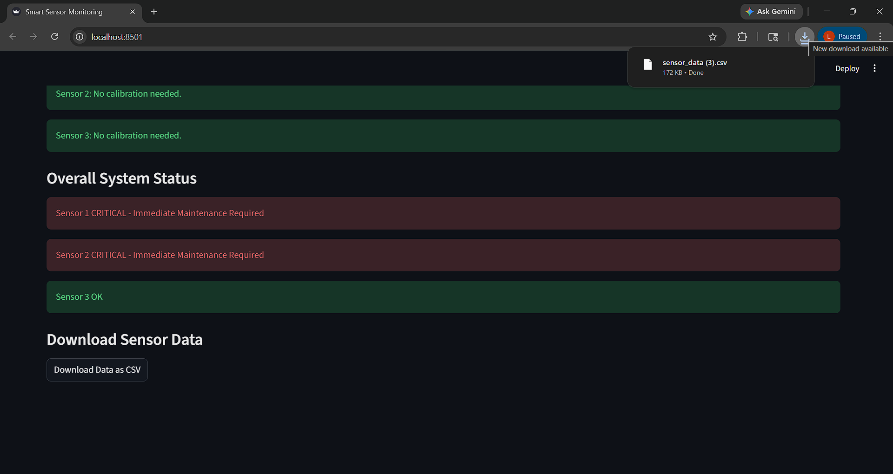

# Smart Sensor Drift Detection and Predictive Calibration using Coreflux LoT

## Project Overview
This project presents an IoT-based Smart Sensor Monitoring System that detects sensor drift, predicts calibration needs, and generates real-time alerts using Coreflux Edge Broker and LoT (Language of Things) automation. The system simulates IoT sensors, processes data at the edge, stores data in a database, and visualizes insights on a real-time dashboard.

## Problem Statement
In industrial environments, sensors drift over time due to environmental conditions and wear, producing inaccurate readings. This can lead to incorrect system behavior, safety risks, and increased maintenance costs. Traditional maintenance is reactive and performed only after failure occurs.

## Solution
Our system continuously monitors sensor data, calculates sensor health, detects drift conditions, predicts calibration requirements, and generates automated alerts using Coreflux LoT rule-based automation.

## System Architecture
The system consists of three layers:
1. Sensor Layer – Simulated temperature sensors generating data.
2. Communication Layer – MQTT protocol and Coreflux Broker handling data communication.
3. Intelligence Layer – LoT rule engine, database storage, dashboard visualization, and prediction analytics.

## Features
- Real-time sensor monitoring
- Sensor drift detection
- Calibration prediction
- Health score calculation
- LoT-based automated alerts
- Predictive maintenance
- Real-time dashboard visualization
- Data export to CSV
- System health monitoring

## Technologies Used
- Python
- MQTT Protocol
- Coreflux Edge Broker
- LoT (Language of Things)
- SQLite Database
- Streamlit Dashboard
- Pandas
- Docker
- MQTT Explorer

## How to Run the Project

### Step 1 – Start Coreflux Broker
docker start coreflux_broker

### Step 2 – Run Sensor Simulator

python sensor_simulator.py

### Step 3 – Run Data Logger

python data_logger.py

### Step 4 – Run Dashboard

streamlit run dashboard.py

### Step 5 – Run LoT Notebook
Run LoT automation rules from smart_sensor.lotnb

## LoT Automation Rules
- Heartbeat monitoring
- Drift alert
- Calibration alert
- Critical alert
- Health logging

## Future Improvements
- Machine learning model for failure prediction
- Email/SMS alert system
- Real sensor hardware integration
- Cloud deployment
- Mobile dashboard

## Conclusion
This project demonstrates an Industrial IoT Predictive Maintenance System using Coreflux LoT Edge Intelligence, enabling early fault detection, reducing downtime, and improving system reliability.
## Output Screenshots

### MQTT Data

### Dashboard Output

### Drift Detection Alert

### System Health Visualization

